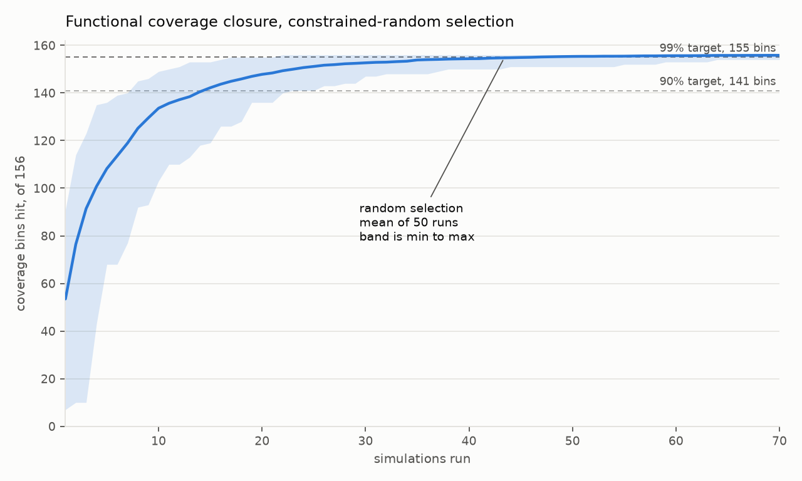

# Novelty-based test selection for coverage closure

This is me trying to reproduce a result from the hardware verification
literature: that if you choose simulation stimuli by how *novel* they are, you
hit a functional coverage target in fewer simulations than if you choose them
at random.

The testbench is Python, using cocotb, and everything runs locally on free
tools. Every number below comes out of a script in `scripts/`, and where
something hasn't been measured I've tried to say so.

**Status: Stage 5 of 7 next.** No claim about novelty selection yet. That starts at
Stage 5.

## What's working so far

- A Python testbench driving both Verilator and Icarus, writing functional
  coverage to disk after every test as a fixed-length binary vector (Stage 1).
- 15/15 functional coverage bins and 14/14 Verilator code coverage points on
  the Stage 1 smoke-test design, with 0 mismatches against a Python reference
  model checked every clock cycle.
- The design under test chosen, and its coverage headroom measured before
  writing any coverage model: 50 simulations, 0 mismatches, showing that
  unbiased random stimulus never pushes the FIFO past about 36 entries no
  matter how deep the FIFO actually is (Stage 2).
- A 156-bin functional coverage model, every bin confirmed reachable, and a
  test length picked by measurement rather than guess. My first attempt at the
  model was too easy and random closed it in 23 tests, which the check caught
  before Stage 4 was built on top of it (Stage 3).
- The random baseline the rest of the project is measured against: 39.9
  simulations to reach 99% coverage, standard deviation 13.1, over 50 runs
  spanning 5 candidate pools (Stage 4).

## What this project isn't

Worth saying early, since anyone who does verification for a living would
notice anyway.

- **No SystemVerilog, no UVM.** The testbench is Python with cocotb. That was a
  constraint I set myself, but it does mean this repo doesn't show the
  SystemVerilog and UVM skills most verification job ads ask for.
- **Open source simulators only.** Verilator and Icarus, not Xcelium or VCS.
  The coverage model in `simlib/covmodel.py` is a hand-rolled stand-in for what
  would normally be a SystemVerilog covergroup.
- **Small design.** A 486-line FIFO. The papers I'm working from used a
  commercial DSP unit and a commercial bus bridge, so anything I get here is at
  a much smaller scale than what they report.
- **No assertions, no formal.** The FIFO I vendored actually ships with formal
  properties and I'm not using them.

The ML method is the part I'd defend. The verification side I'm picking up as I
go, so some of it is probably done in ways a real verification engineer
wouldn't choose.

## Papers I'm working from

- Zheng, Eder & Blackmore, [Using Neural Networks for Novelty-based Test Selection](https://arxiv.org/abs/2207.00445).
  They report up to 49.37% fewer simulations to reach 99.5% coverage on a
  commercial DSP unit.
- Zheng, Blackmore, Buckingham & Eder, [Detecting Stimuli with Novel Temporal Patterns](https://arxiv.org/abs/2407.02510).
  26.9% fewer tests to 98.5% on a bus bridge. This one scores novelty on the
  temporal pattern rather than a static feature vector, which is closer to the
  GRU autoencoder I have built before.
- Bennett & Eder, [Review of Machine Learning for Micro-Electronic Design Verification](https://arxiv.org/abs/2503.11687),
  for background on why most of these techniques haven't reached mainstream
  industry use.

## Setup

```bash
bash scripts/00_install.sh        # apt packages, needs sudo, run once
python3 -m venv .venv && .venv/bin/pip install -r requirements.txt
.venv/bin/python scripts/01_smoke_test.py --sim verilator
```

Versions are in [docs/VERSIONS.md](docs/VERSIONS.md). Short version: Verilator
5.020, Icarus Verilog 12.0 as a fallback, cocotb 1.9.2, Python 3.12.3.

Add `--waves` to dump a waveform and open it in GTKWave:

```bash
.venv/bin/python scripts/01_smoke_test.py --sim verilator --seed 1 --waves
gtkwave results/stage1/waves_seed1.vcd
```

## Code coverage vs functional coverage

I kept conflating these at the start, so writing it down.

Code coverage (line, branch, toggle) is what the simulator gives you for free.
It tells you which lines of RTL ran and which signal bits flipped both ways. It
doesn't tell you whether the design ever got into an interesting *state*.

Functional coverage is a list someone writes by hand of the situations that
actually matter, like a FIFO going full, or an arbiter handing the grant from
one master to another. The testbench watches for them and ticks them off.

The experiment measures functional coverage. I collect code coverage as well,
but only as a sanity check.

## Stage 1: does the toolchain work

No ML in this stage. The only goal was to get a simulation running from Python
with coverage landing on disk, because I had been warned this is where projects
like this stall. That warning was correct. It took most of a weekend and almost
none of it was interesting.

The design here is throwaway. [`rtl/counter.v`](rtl/counter.v) is an 8-bit
counter with a count enable, synchronous load, asynchronous active-low reset
and a wrap flag. I wrote it in Verilog-2001 rather than SystemVerilog so both
simulators would take it without extra flags.

```bash
.venv/bin/python scripts/01_smoke_test.py --sim verilator --seed 1
.venv/bin/python scripts/01_smoke_test.py --sim icarus    --seed 1
```

That writes into `results/stage1/`:

- `functional_coverage_seed<N>.json`: 15/15 bins hit, per-bin counts, and the
  binary coverage vector for that test
- `coverage.dat`: Verilator code coverage, 26 raw points
- `code_coverage_summary.txt`: `Total coverage (14/14) 100.00%`
- `coverage_annotated/counter.v`: the RTL with per-line execution counts

Both simulators pass with 0 mismatches against a Python reference model that
gets checked every clock cycle.

I also checked that the same seed gives bit-identical coverage vectors and
identical per-bin hit counts on both simulators (611 cycles, 0 errors). That
seemed worth confirming rather than assuming, since later stages compare
vectors that were produced by separate runs.

### Things that broke

Writing these down because most of them failed quietly instead of erroring.

**Scoreboard off by one, 446 false mismatches.** My first version of the
testbench drove signals directly in between phases, and one clock edge slipped
past unobserved while `en` was still high. The reference model missed that
increment and then stayed one behind the DUT for the rest of the run, so
everything after that point looked like a failure. The fix was not local: every
cycle now goes through a single `CounterEnv.step()` that drives, advances,
updates the reference model and samples coverage, so there's nowhere for an
edge to hide.

**`verilator_coverage --annotate` wrote nothing and exited 0.** It only writes
out files that still have uncovered points in them. At 100% coverage you get an
empty directory and no error message, which took me a while to work out. Need
`--annotate-all`.

**No `+verilator+coverage+file+` in Verilator 5.020.** cocotb's source has a
comment saying you can point the coverage output somewhere with this plusarg. I
couldn't get it to do anything, and checking `verilated.cpp` the runtime only
parses `+verilator+{debug,error+limit,prof+*,rand+reset,seed,version}`. I think
the comment describes a newer version. So `coverage.dat` has to be collected
from the simulation's working directory instead.

**Icarus needs a timescale.** It has no default, so a 10 ns clock isn't
representable and the test dies with a precision error. Verilator doesn't
care. Passing the timescale from the runner instead of putting it in the RTL
keeps the design simulator-neutral.

## Stage 2: picking the design under test

Three candidates, all open source and small enough to read in an evening.

| | Sync FIFO | Round-robin arbiter | AXI-Lite to WB bridge |
|---|---|---|---|
| Source | ZipCPU `sfifo.v` | alexforencich `arbiter.v` | ZipCPU `axlite2wbsp.v` |
| Size | 486 lines, 1 file | ~245 lines, 2 files | ~450 lines, 5 to 6 files |
| License | public domain | MIT | Apache-2.0 |
| Stimulus difficulty | low, 2 control bits | low to medium | high, 5-channel protocol |
| Hard states are | temporal | mostly combinational | temporal plus protocol |

I went with the FIFO. Its hard states need a pattern rather than one lucky
cycle, the stimulus is two bits wide so I can't drive it illegally, and
`LGFLEN` gives me a difficulty dial. Provenance, the exact RTL semantics, and
why I turned down the other two are in [docs/DUT.md](docs/DUT.md). The arbiter
is being kept for Stage 7, where the question is whether any gain survives a
change of design.

### Measuring the headroom first

Before writing a coverage model it seemed worth knowing whether random stimulus
struggles at all. If one random test reaches every interesting state then there
is no gap for a smarter selector to close, and the honest answer would be "no
difference". So I measured it rather than assuming.

```bash
.venv/bin/python scripts/02_headroom_probe.py --depths 4 5 6 7 8 --seeds 5 --cycles 500
```

50 simulations, 500 cycles each, two stimulus biases, five seeds, 0 scoreboard
mismatches against a Python reference FIFO. Raw data is in
`results/stage2/probe_summary.json`. The whole sweep takes 38 seconds and comes
back byte-identical on a rerun, so it's cheap to redo rather than take my word
for it.

| Depth | Stimulus | Seeds reaching full | Mean max fill | % cycles full |
|---|---|---|---|---|
| 16 | unbiased, p=0.5/0.5 | 3/5 | 15.2 | 2.64% |
| 16 | write-heavy, 0.7/0.3 | 5/5 | 16.0 | 51.88% |
| 32 | unbiased | 2/5 | 22.4 | 0.48% |
| 32 | write-heavy | 5/5 | 32.0 | 47.32% |
| 64 | unbiased | 0/5 | 23.2 | 0.00% |
| 64 | write-heavy | 5/5 | 64.0 | 38.32% |
| 128 | unbiased | 0/5 | 23.2 | 0.00% |
| 128 | write-heavy | 5/5 | 128.0 | 19.88% |
| 256 | unbiased | 0/5 | 23.2 | 0.00% |
| 256 | write-heavy | 0/5 | 199.2 | 0.00% |

Occupancy distribution, pooled over seeds:

| Depth | Stimulus | median fill | p90 | p99 | max seen |
|---|---|---|---|---|---|
| 32 | unbiased | 8 | 25 | 31 | 32 |
| 32 | write-heavy | 31 | 32 | 32 | 32 |
| 64 | unbiased | 8 | 26 | 34 | 36 |
| 64 | write-heavy | 63 | 64 | 64 | 64 |

### What that actually means

Unbiased stimulus is a plus-or-minus-one random walk on the fill level. It sits
around a median of 8 and never gets past 36 regardless of how deep the FIFO is.
Depths 64, 128 and 256 all give the same 23.2 mean max fill, because past about
36 the extra depth isn't reachable, so it stops mattering.

So whether the FIFO ever fills is decided by the stimulus, not by the FIFO. At
depth 64 the interesting states are unreachable under unbiased stimulus and
trivial under write-heavy stimulus. That's the structure I need. It also means
the difficulty isn't in the RTL parameters, it's in the space of stimulus
sequences the generator can produce.

Two things I'm carrying into the next stages:

- Stage 3 should bin the occupancy so that there are real bins above fill 36,
  where unbiased stimulus doesn't go.
- Stage 4 has to sample the stimulus parameter space, not just flip p=0.5
  coins. A baseline that only ever produces unbiased traffic would be easy to
  beat, and the improvement would be an artefact of a weak baseline rather than
  a real result.

## Stage 3: the coverage model

A functional coverage model is a list, written by hand, of situations the
design ought to be put in. The testbench watches for them and ticks them off.
Stages 4 to 6 are all about closing this list, so I wrote it in plain English
first, and it's frozen before any selector runs.

### Depth 32

`LGFLEN=5`. That came from the Stage 2 numbers rather than preference. Depth 16
is too easy, unbiased random reached full in 3 of 5 seeds. Depth 64 is too
hard, 0 of 5, and the model might never close. Depth 32 got 2 of 5, with a 99th
percentile occupancy of 31.

### What I'm trying not to do

Every bin has to be justifiable from how the FIFO behaves, not from what random
happens to miss. Picking bins because random can't reach them would be
inventing the gap I then take credit for closing. So the model came first and I
checked reachability afterwards, as a sanity test.

One detail shapes a lot of it. Writes to a full FIFO and reads from an empty
one are silently dropped by this design, so asserting `i_wr` while full and
having a write accepted are different events. The operation bins count what the
testbench attempted, since that's what exercises the gating. The burst bins
count what was accepted, since a run of writes only means something if data
moved.

### The bins

- **132 bins, operation crossed with fill level.** The four things the
  testbench can do in a cycle (nothing, write, read, both) crossed with all 33
  fill levels. This is the ordinary SystemVerilog idiom of binning a counter per
  value and crossing it with the operation, and it's where nearly all the
  difficulty is. Being at exactly fill 29 while attempting a simultaneous read
  and write is a specific thing to arrange.
- **8 transition bins.** Each boundary crossed in both directions, plus sitting
  at full and at empty for more than one cycle. A FIFO that fills correctly can
  still drain wrongly.
- **4 wraparound bins.** The read and write addresses running off the end of
  memory, on their own and combined with a boundary.
- **5 reset bins.** Reset while empty, partly full and completely full, and
  reset arriving while an operation is pending.
- **7 burst bins.** Sustained one-sided traffic at a quarter and half the
  depth, bursts that end at full or empty, and simultaneous traffic held for
  four cycles.

156 bins total. Each test writes out a 156-element binary vector, and that's
what the Stage 5 selectors consume.

### My first model was too easy

The first version had 52 bins, with occupancy in bands rather than per level.
Random sampling of the stimulus parameter space hit 40 of the 52 on the first
test and closed all 52 by test 23. That would have wasted Stage 4, since you
can't measure a 27% to 49% saving against a target that random reaches in 23
tests. Going to a per-fill-level cross is standard granularity for a FIFO this
size, and it gave the model somewhere to hide.

Test length mattered as much as the bin count:

| Cycles per test | Random closes at | |
|---|---|---|
| 60 | never, 152/156 after 120 tests | 4 bins out of reach at that length |
| 120 | test 60 | 144 bins by test 15, then a long tail |
| 250 | test 37 | mostly done by test 16 |

120 is the shortest length where everything still closes, so a test is 120
cycles from here on.

### Checking it

```bash
.venv/bin/python scripts/03_coverage_model.py --seeds 5 --feasibility 80
.venv/bin/python scripts/03_coverage_model.py --list        # print the bins
.venv/bin/python scripts/03_coverage_model.py --crosscheck  # both simulators
```

115 simulations, 0 scoreboard mismatches, about 15 seconds. Raw data in
`results/stage3/model_check.json`.

| Coverpoint | Bins | Unbiased Bernoulli | Any stimulus |
|---|---|---|---|
| op_x_fill | 132 | 115 | 132 |
| transition | 8 | 3 | 8 |
| wrap | 4 | 3 | 4 |
| reset | 5 | 0 | 5 |
| burst | 7 | 2 | 7 |
| **total** | **156** | **123** | **156** |

Every bin is reachable by something, so nothing is permanently stuck. That was
the main thing I wanted out of this.

**The 123 is not the baseline.** Unbiased Bernoulli means `p_reset=0` and no
bursts, so it can't reach the reset bins at all. Quoting it as what random
achieves would be inflating my own result. The honest preview is random over the
whole parameter space, at the real 120-cycle test length:

| After N tests | 1 | 5 | 10 | 15 | 23 | 37 | 60 |
|---|---|---|---|---|---|---|---|
| Bins covered | 75 | 114 | 128 | 144 | 153 | 155 | 156 |

A fast climb to 144 in 15 tests, then 12 bins that take another 45. The tail is
where selection could matter. It's also thin enough that any difference might
sit inside the seed noise, and I'd rather write that down now than find it out
in Stage 6.

Both simulators produce identical vectors for the same spec and seed, down to
the per-bin hit counts. Stages 4 to 6 pool vectors from separate simulator
processes, so that one is worth checking rather than assuming.

### Things that broke

**Neither the Stage 2 nor the Stage 3 script worked under Icarus.** cocotb
wants the timescale on `build()` and on `test()`, and I'd only passed it to
`test()`. Verilator doesn't care, Icarus dies with a precision error. Same bug
as Stage 1, reintroduced by copying the `test()` call and not the other one.
Both scripts offered `--sim icarus` and neither had ever been run. There's now
a single helper in `simlib/simrunner.py` that starts every simulation, so
there's no second place left to forget it.

**Reading `o_data` threw on Icarus only.** The FIFO's memory starts at X there
and at zero under Verilator, so resolving the data output before the first
write raised on one simulator and quietly returned 0 on the other. It's now
only resolved when the FIFO reports non-empty, and an X at that point counts as
a scoreboard failure instead of crashing the run.

**Rerunning a script with different arguments overwrote committed results.**
Testing the Icarus fix clobbered the 50-simulation Stage 2 data that the tables
above quote, and nothing in the file said which run had produced it. Restored
from git, and both summary files now record the arguments that made them.

## Stage 4: the random baseline

This is the curve everything else is measured against, so the targets are
written down here before the baseline was run, and before any selector exists.

### Targets, fixed in advance

| Target | Bins of 156 |
|---|---|
| 90% | 141 |
| 95% | 149 |
| 98% | 153 |
| 99% | 155 |
| 100% | 156 |

**99% is the headline**, which is 155 of 156 bins. That sits inside the
98.5% to 99.5% band the two papers report against, so it's their choice rather
than one I picked after looking at my own curve. The others are reported too,
because a saving that only shows up at one target isn't worth much and Stage 7
has to check that.

### How the experiment is set up

The papers do test *selection*, not test generation. You have candidate stimuli
and you decide which ones to spend simulation time on. Random selection picks at
random, novelty selection picks what looks new. For Stage 6 to be a fair
comparison, both have to be choosing from the same candidates.

So: generate a pool of candidate specs, simulate each one once, and cache the
coverage vector it produced. A test's coverage is fully determined by its spec
and its seed, so after that any selection order can be replayed from the cache
without simulating anything again. All the compute in this project lands here.

Two sources of variance, so both get sampled: 5 independent pools of 400
candidates each, from different generator seeds, and 10 random orderings within
each pool. 50 curves in total. Quoting variance over orderings alone would
understate it, since it would hold the candidate set fixed.

### What it costs

```bash
.venv/bin/python scripts/04_random_baseline.py
.venv/bin/python scripts/check_invariants.py   # no simulator needed
```

2000 simulations at about 350 ms each, so roughly 11 minutes the first time.
Every result is cached by spec and seed, so a rerun is instant and Stages 5 and
6 pay nothing. All 5 pools can reach all 156 bins, which matters: a pool that
couldn't would make the 100% target unreachable and the numbers meaningless.
The script prints that check.

### The baseline

50 runs over 2000 simulations, raw data in `results/stage4/baseline.json`.
Every simulation is checked against the reference FIFO and the pool builder
raises on the first mismatch, so a pool that finishes building had none.

| Target | Bins | Mean tests | Median | Std dev | Min | Max |
|---|---|---|---|---|---|---|
| 90% | 141 | 14.2 | 13.5 | 4.4 | 8 | 23 |
| 95% | 149 | 20.2 | 20.0 | 5.8 | 10 | 37 |
| 98% | 153 | 29.6 | 28.0 | 9.1 | 13 | 59 |
| **99%** | **155** | **39.9** | **38.0** | **13.1** | **17** | **91** |
| 100% | 156 | 53.5 | 48.5 | 23.4 | 22 | 148 |



So the number to beat is **39.9 simulations to reach 99% coverage**, and every
run reached every target.

### The variance is the interesting part

The standard deviation is about a third of the mean at every target, and 44% of
it at 100%. The distribution is skewed right: at the 99% target the median run
takes 38 tests and the worst takes 91. Random selection is not just slow, it's
erratic, and a single run tells you very little.

Splitting the variance at the 99% target shows where it comes from:

| Source | Spread |
|---|---|
| Between pools, standard deviation of the 5 pool means | 6.8 |
| Within a pool, mean standard deviation over orderings | 12.1 |

Ordering matters more than which candidates you happened to generate, but the
pool is not negligible either. The five pool means run from 31.3 to 49.0, a
factor of 1.6. If I'd used one pool and 50 orderings, the baseline I quote could
have been 31 or 49 depending on which pool I drew, and I'd have had no way to
know. That's the argument for sampling both.

### Can Stage 6 actually measure anything

Worth working out now rather than after building a selector.

The papers report savings of 27% to 49%. Against a mean of 39.9, a 27% saving
is about 11 fewer tests. The standard deviation is 13.1, so that improvement is
smaller than the run-to-run noise. Any single pair of runs could easily show
novelty losing.

What saves it is the number of runs. With 50 runs the standard error of the
mean is 1.85, so an 11-test shift is roughly 6 standard errors apart and
perfectly measurable *in the mean*. Two consequences for Stage 6:

- The comparison has to be **paired**: run both selectors on the same pool with
  the same ordering seed, and look at the per-pair difference. That removes the
  between-pool variance entirely instead of averaging over it.
- The result has to be reported as a difference in means with an interval, not
  as "novelty wins". With distributions this wide, "novelty wins on average by
  X with interval Y" is true and "novelty is better" is not.

### Checking the parts that fail quietly

`scripts/check_invariants.py` runs 18 checks with no simulator involved. They
cover the things that would make the Stage 6 comparison wrong without anything
visibly breaking: that a `Candidate` carries no coverage field and an
adversarial selector poking at its arguments finds none, that a selection
episode never picks the same candidate twice and ends at the pool's union
coverage, that a larger pool extends a smaller one rather than reshuffling it
so cached results stay valid, and that candidate seeds don't collide across
pools.

I also re-simulated six cached candidates from scratch and compared them
against the cache. Identical vectors, which is the thing the replay trick
depends on.

## Plan for the rest

3. ~~Write the functional coverage model.~~ **Done. 156 bins, all reachable,
   120-cycle tests. Each test emits a storable coverage vector.**
4. ~~Constrained-random baseline.~~ **Done. 39.9 simulations to 99% coverage,
   standard deviation 13.1, over 50 runs.**
5. The novelty selector. Start with distance in a hand-built feature space,
   then try a GRU autoencoder scoring novelty by reconstruction error or by
   distance to k-means centroids in the latent space. The simple version stays
   in the comparison, and if the neural one doesn't beat it I want to know.
6. Compare. Same design, same coverage model, same target, same seeds. Report
   the reduction with its variance across seeds, not as a single number.
7. Honesty pass. Check whether the novelty score is getting any information
   from coverage results, directly or indirectly. If it is, then what I built is
   coverage-*directed* selection, which is a real technique but a different and
   easier claim, and this README has to say which one it was. Also check whether
   any gain survives a different coverage target and a different design. If
   novelty doesn't beat random, that goes here as the result.

## Layout

```
rtl/       designs under test
tb/        cocotb testbenches
simlib/    shared code (coverage model, later the selectors)
scripts/   numbered entry points
results/   measured output
docs/      versions, DUT provenance, notes
```

## License and third-party code

My code is MIT, see [LICENSE](LICENSE).

`rtl/sfifo.v` isn't mine. It's from [ZipCPU/wb2axip](https://github.com/ZipCPU/wb2axip),
written by Dan Gisselquist, released to the public domain, and vendored here
unmodified. The upstream commit and a checksum are recorded in
[docs/DUT.md](docs/DUT.md). `rtl/counter.v` is mine, written as a throwaway for
Stage 1.
